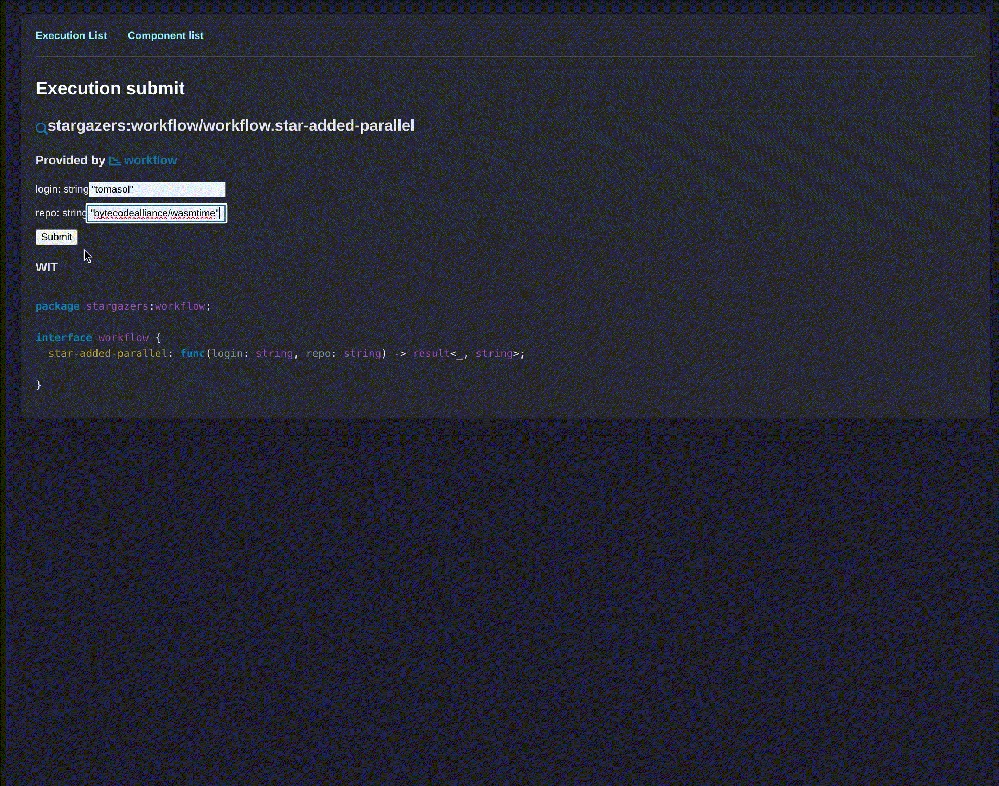

<h1>
  <a href="https://obeli.sk">
     Obelisk
  </a>
</h1>

A [deterministic](https://obeli.sk/faq/) workflow engine built on the WASM Component Model.

> [!WARNING]
> **Pre-release**: Expect changes in CLI, gRPC, WIT, and database schema.

## Obelisk in Action
[](https://obeli.sk/screencast.webm)

The [Stargazers](https://github.com/obeli-sk/demo-stargazers) app features:
- A webhook listening to GitHub star events.
- Activities for interacting with Turso DB, OpenAI, and GitHub.
- A workflow orchestrating the activities.

[Obelisk fly.io deployment tool](https://github.com/obeli-sk/obelisk-deploy-flyio) features:
- A complete workflow for deploying Obelisk apps on fly.io
- Cleanup / compensating actions on failure

## What's Included
- **Obelisk Runtime**: A single binary executing deterministic workflows, activities,
and webhook endpoints, persisting steps in execution log using SQLite or PostgreSQL.
- **Control Interfaces**:
  - **CLI**: Manage executions via the `obelisk` command.
  - **gRPC API**: Programmatic interaction.
  - **Web UI**: View and submit function executions, execution logs, WIT definitions, and a time-traveling debugger showing backtraces and sources of recorded events.

## Core Principles
- **Replayable Workflows**: Deterministic execution ensures reliable recovery, debugging, and auditing.
- **Resilient Activities**: Automatic retries on errors and timeouts, with persistent input and results.
- **Schema-first design with end-to-end type safety**:
Uses [WASM Component Model](https://component-model.bytecodealliance.org/) and
[WIT IDL](https://component-model.bytecodealliance.org/design/wit.html) for generating API bindings.

## Use Cases
- Sandboxing and auditing of [**AI-Assisted Code**](https://obeli.sk/blog/taming-ai-assisted-code/)
- **Periodic Tasks**: Automate periodic checks with complex logic using regular code.
- **Background Jobs**: Offload tasks with built-in error handling and retries.
- **Batch jobs**: Manage large-scale tasks like faas deployments.
- **End-to-End Testing**: Automate tests with detailed logs of each step.

## Key Features
### [**WASI Activities**](https://obeli.sk/docs/latest/concepts/activities/)
- Activities must be idempotent (retriable). This contract must be fulfilled by the activity itself.
- Support for HTTP requests via WASI 0.2 HTTP client.
- Automatic retries on errors, timeouts, and panics (WASM traps).
- Persistent execution results.

### [**Deterministic Workflows**](https://obeli.sk/docs/latest/concepts/workflows/)
- Runtime guaranteed determinism, fully replayable with persistent execution log and thus crash resilient.
- Automatic retries on timeouts.
- Support for spawning child executions with [structured concurrency](https://obeli.sk/docs/latest/concepts/structured-concurrency/).

### [**WASI Webhook Endpoints**](https://obeli.sk/docs/latest/concepts/webhook-endpoints/)
- Mounted as a URL path, serving HTTP traffic.
- Support for spawning child executions.

### **Work Stealing Executor**
- Concurrency limits and customizable retry handling.

## Installation
### Supported Platforms
- Linux x64, arm64 (musl, glibc v2.35+, NixOS)
- MacOS x64, arm64

### Pre-built Binary
```sh
curl -L --tlsv1.2 -sSf https://raw.githubusercontent.com/obeli-sk/obelisk/main/download.sh | bash
```
Or use [cargo-binstall](https://crates.io/crates/cargo-binstall):
```sh
cargo binstall obelisk
```

### Docker
```sh
# Use host's network. Ports 8080 (web) and 5005 (grpc) will be bound to 127.0.0.1
mkdir config
docker run getobelisk/obelisk generate config > config/obelisk.toml
docker run \
  --net=host
  -v $(pwd)/config:/config \
  getobelisk/obelisk \
  server run --config /config/obelisk.toml

# Forward ports explicitly
docker run \
  -p 8080:8080 -e 'OBELISK__webui__listening_addr=0.0.0.0:8080' \
  -p 5005:5005 -e 'OBELISK__api__listening_addr=0.0.0.0:5005' \
  -v $(pwd)/config:/config \
  getobelisk/obelisk \
  server run --config /config/obelisk.toml

# Share the cache directory from host
docker run --net=host \
  -u $(id -u):$(id -g) \
  -v $(pwd)/config:/config \
  -e 'OBELISK__WASM__CACHE_DIRECTORY=/cache/obelisk/wasm' \
  -v ~/.cache/obelisk/wasm:/cache/obelisk/wasm \
  getobelisk/obelisk \
  server run --config /config/obelisk.toml
```

### From Source
Requires [`protoc`](https://protobuf.dev/downloads/).
```sh
cargo install --locked obelisk
```
Using Nix:
```sh
nix run github:obeli-sk/obelisk/latest
```

For more options see [Installation](https://obeli.sk/install/).

## Getting Started

Check out the [Getting Started Guide](https://obeli.sk/docs/latest/getting-started/) for details.

### Start the Server
```sh
obelisk server run -c obelisk-testing-sqlite-oci.toml
```

### Running with Postgres
```sh
docker run -it --rm \
  --name obelisk-postgres \
  -e POSTGRES_PASSWORD=postgres \
  -p 5432:5432 \
  postgres:18

# export env vars if .envrc is not used
export POSTGRES_HOST="localhost"
export POSTGRES_USER="postgres"
export POSTGRES_PASSWORD="postgres"
export POSTGRES_DATABASE="obelisk"

obelisk server run --config obelisk-testing-postgres-oci.toml
```

### [CLI Usage](https://obeli.sk/docs/latest/cli/)
```sh
obelisk client component list
# Call fibonacci(10) activity from the workflow 500 times in series.
obelisk client execution submit testing:fibo-workflow/workflow.fiboa '[10, 500]' --follow
```

### Web UI
Visit [localhost:8080](http://127.0.0.1:8080) to manage components, functions and execution history.

## Contributing
This project has a [roadmap](ROADMAP.md) and features are added in a certain order.
Discuss features via [GitHub Discussions](https://github.com/obeli-sk/obelisk/discussions) before contributing.
A [Contributor License Agreement](https://cla-assistant.io/obeli-sk/obelisk) is required.

## Development
Set up dependencies via Nix:
```sh
cp .envrc-example .envrc
$EDITOR .envrc
direnv allow
# If direnv is not available use `nix develop`
```
Or manually install dependencies (see [dev-deps.txt](dev-deps.txt)).

Run the program:
```sh
cargo run --release
```

## Running Tests
Postgres must be running. See `.envrc-example` for how to set up the environment variables.
```sh
./scripts/test.sh
```

# Project Licensing Information

This project (all files and folders except as noted below) is licensed
under the [GNU Affero General Public License version 3](LICENSE-AGPL).

## Subfolder Exceptions

The following subfolders are licensed under the MIT License:

* `wit/`   – see [LICENSE-MIT](wit/LICENSE-MIT)
* `toml/`  – see [LICENSE-MIT](toml/LICENSE-MIT)
* `proto/` – see [LICENSE-MIT](proto/LICENSE-MIT)

## Generated WIT Files

The runtime includes functionality that may generate new "extension" WIT files. These generated files are typically based on a combination of user-provided WIT files and the base WIT definitions found in the MIT-licensed `wit/` directory.

Users are free to use, modify, and distribute these generated WIT files under the terms of the MIT License, for example, to allow other WASM components to interact via these extended interfaces.
