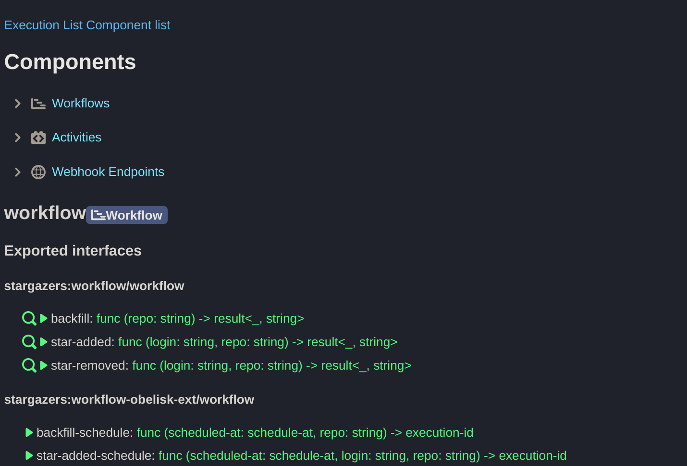

# Obelisk
A deterministic workflow engine built on the WASM Component Model.

> [!WARNING]
> **Pre-release**: Expect changes in CLI, gRPC, WIT, and database schema.

## What's Included
- **Obelisk Runtime**: A single binary executing deterministic workflows, activities,
and webhook endpoints, persisting steps in execution log using SQLite.
- **Control Interfaces**:
  - **CLI**: Manage executions via the `obelisk` command.
  - **gRPC API**: Programmatic interaction.
  - **Web UI**: View executions and submit function executions.

## How It Works
- **Schema-first design with end-to-end type safety**:
Uses [WASM Component Model](https://component-model.bytecodealliance.org/) and
[WIT IDL](https://component-model.bytecodealliance.org/design/wit.html) for generating API bindings.
- **Resilient Activities**: Automatic retries on errors and timeouts, with persistent input and results.
- **Replayable Workflows**: Deterministic execution ensures reliable recovery, debugging, and auditing.

## Use Cases
- **Periodic Tasks**: Automate checks, send emails, or suspend projects.
- **Background Jobs**: Offload tasks with built-in error handling and retries.
- **Batch jobs**: Manage large-scale tasks like deployments.
- **End-to-End Testing**: Automate tests with detailed logs.
- **Webhook Integrations**: Trigger workflows from external events (e.g., GitHub).
- **Running AI Generated Code**: Code is sandboxed and every step can be audited.

## Key Features
### **Activities**
- Must be idempotent (retriable). This contract must be fulfilled by the activity itself.
- Executed in a WASM sandbox.
- Support for HTTP requests via WASI 0.2 HTTP client.
- Execution timeout handling.
- Automatic retries on errors, timeouts, and panics.
- Persistent execution results.

### **Deterministic Workflows**
- Fully replayable with persistent execution log.
- Executed in a WASM sandbox.
- Automatic retries on failures.
- Support for spawning child executions in join sets and structured concurrency.
- Distributed sagas (planned).

### **Webhook Endpoints**
- Mounted as a URL path, serving HTTP traffic.
- Executed in a WASM sandbox.
- Support for spawning child executions.

### **Work Stealing Executor**
- Concurrency limits and customizable retry handling.

## Obelisk in Action


The [Stargazers](https://github.com/obeli-sk/demo-stargazers) app features:
- A webhook listening to GitHub star events.
- Activities for interacting with Turso DB, ChatGPT, and GitHub.
- A workflow orchestrating the activities.


## Installation
### Supported Platforms
- Linux x64, arm64 (musl, glibc v2.35+, NixOS)
- macOS 13 x64
- macOS 14 arm64

### Pre-built Binary
```sh
curl -L --tlsv1.2 -sSf https://raw.githubusercontent.com/obeli-sk/obelisk/main/download.sh | bash
```
Or use [cargo-binstall](https://crates.io/crates/cargo-binstall):
```sh
cargo binstall obelisk
```

### Docker
```sh
docker run --net=host getobelisk/obelisk
```

### From Source
Requires [`protoc`](https://protobuf.dev/downloads/).
```sh
cargo install --locked obelisk
```
Using Nix:
```sh
nix run github:obeli-sk/obelisk/latest
```

## Getting Started

### Create Components from a Template
See [obelisk-templates](https://github.com/obeli-sk/obelisk-templates/).

### Configuration
Check [obelisk.toml](obelisk.toml) for configuration details.

### Generate a Sample Config
```sh
obelisk server generate-config
```

### Start the Server
```sh
obelisk server run
```

### CLI Usage
```sh
obelisk client component list
# Call fibonacci(10) activity from the workflow 500 times in series.
obelisk client execution submit testing:fibo-workflow/workflow.fiboa '[10, 500]' --follow
```

### Web UI
Visit [localhost:8080](http://127.0.0.1:8080) to manage components, functions and execution history.

## Contributing
This project has a [roadmap](ROADMAP.md) and features are added in a certain order.
Discuss features via [GitHub Discussions](https://github.com/obeli-sk/obelisk/discussions) before contributing.
A [Contributor License Agreement](https://cla-assistant.io/obeli-sk/obelisk) is required.

## Development
Set up dependencies via Nix:
```sh
nix develop
```
Or manually install dependencies (see [dev-deps.txt](dev-deps.txt)).

Run the program:
```sh
cargo run --release
```

## Running Tests
```sh
./scripts/test.sh
```
